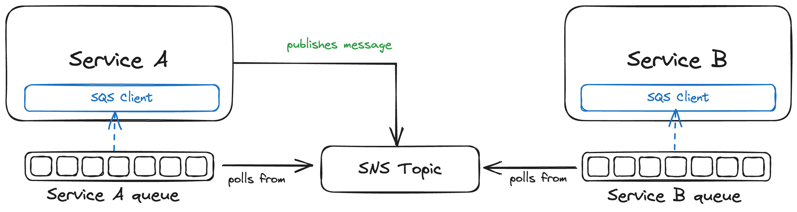

# Event-Driven Architecture using SNS/SQS and Node.js microservices

## Goal

The goal of this repository is to provide a minimal example of how two Node.js microservices can communicate with each other using SNS and SQS and try it locally using [localstack](https://localstack.cloud/).

## Architecture



There are two Node.js services:
- service A
- service B

*Service A* publishes an event to a *SNS topic*.
There are 2 *SQS queues*, one for each service.
Each of these 2 queues is subscribed to the SNS topic *service A* is publishing to, which means they both receive the events that are published on the topic.

In this example, only *service B* actually implements the SQS client and cares about the messages published on its queue.

## Benefits

- Both services are fully decoupled: service A doesn't even know about the existence of service B, yet it can communicate with it
- Using queues make our application resilient: if one of the services goes down, the messages go to the queue and get processed as soon as the service gets back online

## Run this locally with localstack

1. Install localstack
2. Run `./deploy-localstack.sh` to deploy the services to localstack. This will deploy the cloudformation template in `infra.yml`.
3. Once this is done, run service B in a terminal:
`node ./services/B/src/index.js`.

Service B will be waiting for messages to be published to the topic by service A.

4. To publish a message to SNS from service A, run in another terminal:
`node ./services/A/src/index.js`

Now you should see in the first terminal that service B received an event.

```
[*] Event received: {
  id: '62d2b85b-b3e1-44b2-a7cc-e215c92fc97c',
  publishedAt: '2023-08-08T20:21:56.808Z',
  type: 'MY_EVENT',
  payload: { entityId: '123' }
}
```

You can destroy the stack that was created by running `./destroy-localstack.sh`